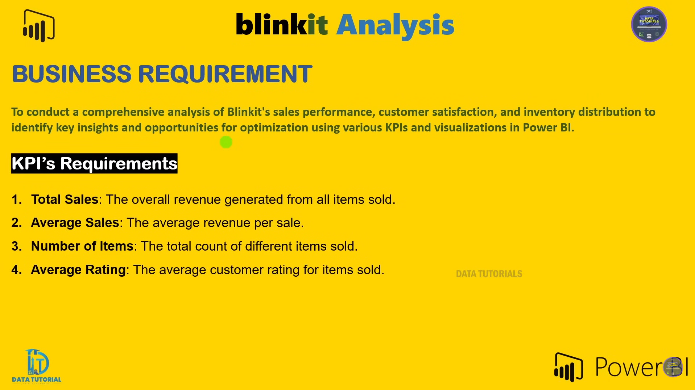

# BlinkIT Grocery Dashboard

## Overview
This repository contains a Power BI dashboard project aimed at analyzing and visualizing grocery data from BlinkIT. The dashboard is designed to provide insights into various aspects of the grocery business, leveraging data from an Excel file as its primary data source.


## Screenshots
1. **Dashboard Overview**  
   
   
   
   
   
---

## Files in This Repository
- **`BlinkIT Grocery Data.xlsx`**: The data source containing grocery-related data.
- **`blinkit.pbit`**: The Power BI template file that creates the dashboard.

---

## Prerequisites
Before using the Power BI file, ensure you have the following:
1. **Power BI Desktop**: Download and install from [Microsoft Power BI](https://powerbi.microsoft.com/desktop/).
2. **Excel**: Ensure Excel is installed for viewing or modifying the data source.

---

## How to Use
1. **Clone this repository**:
   ```bash
   git clone https://github.com/shrinivask007/Blinkit-Data-Analysis-PowerBI
   cd Blinkit-Data-Analysis-PowerBI

Based on the uploaded files (BlinkIT Grocery Data.xlsx and blinkit.pbit), here's the content for a README.md file tailored to your Power BI project:

markdown
Copy code
# BlinkIT Grocery Dashboard

## Overview
This repository contains a Power BI dashboard project aimed at analyzing and visualizing grocery data from BlinkIT. The dashboard is designed to provide insights into various aspects of the grocery business, leveraging data from an Excel file as its primary data source.

---

## Files in This Repository
- **`BlinkIT Grocery Data.xlsx`**: The data source containing grocery-related data.
- **`blinkit.pbit`**: The Power BI template file that creates the dashboard.

---

## Prerequisites
Before using the Power BI file, ensure you have the following:
1. **Power BI Desktop**: Download and install from [Microsoft Power BI](https://powerbi.microsoft.com/desktop/).
2. **Excel**: Ensure Excel is installed for viewing or modifying the data source.

---

## How to Use
1. **Clone this repository**:
   ```bash
   git clone https://github.com/<your-username>/BlinkIT-Grocery-Dashboard.git
   cd BlinkIT-Grocery-Dashboard

2. Open the Power BI Template (blinkit.pbit):
- Launch Power BI Desktop.
- Open blinkit.pbit from the repository folder.
- Power BI will prompt you to connect to the data source (BlinkIT Grocery Data.xlsx).

3. Ensure Data Connection:
- Power BI will ask for the file path of the Excel data source. Navigate to BlinkIT Grocery Data.xlsx in the repository folder.
- Load the data into the Power BI dashboard.

4. Customize and Analyze:
- Use the pre-built visuals to explore the data.
- Customize filters and visualizations as needed.

## Features of the Dashboard
- Comprehensive Data Insights: Provides detailed analysis of grocery data.
- Interactive Visualizations: Easily filter and drill down into specific data points.
- Template-Driven Design: Quick deployment for similar datasets.

## Contribution
 Contributions are welcome! Feel free to fork the repository and submit a pull request.

## License
This project is licensed under the MIT License. See the LICENSE file for details.

## Contact
If you have any questions or need further assistance, please contact:

Your Name: shrinivassk18@gmail.com